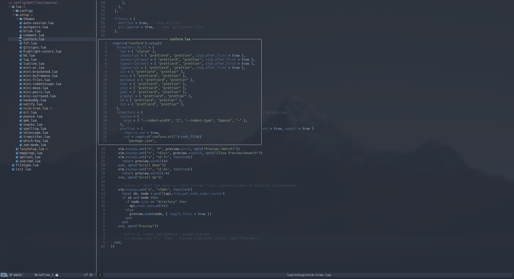
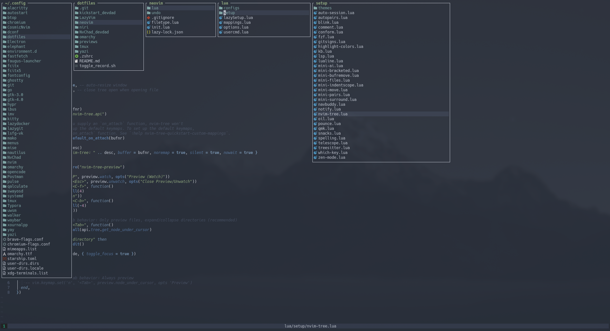
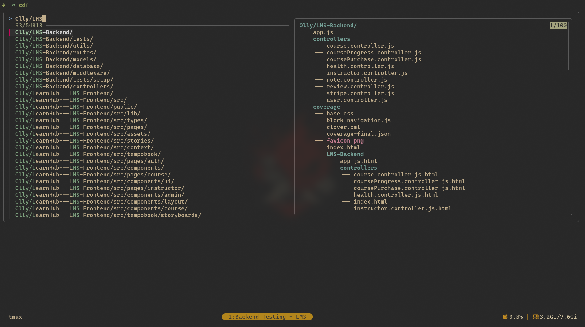
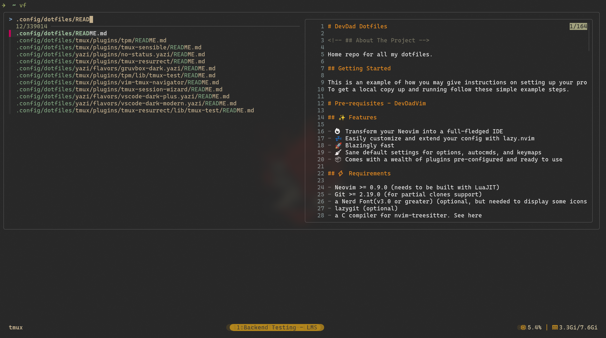
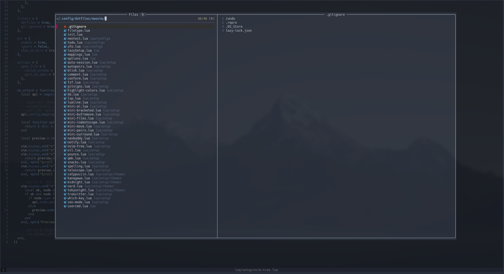
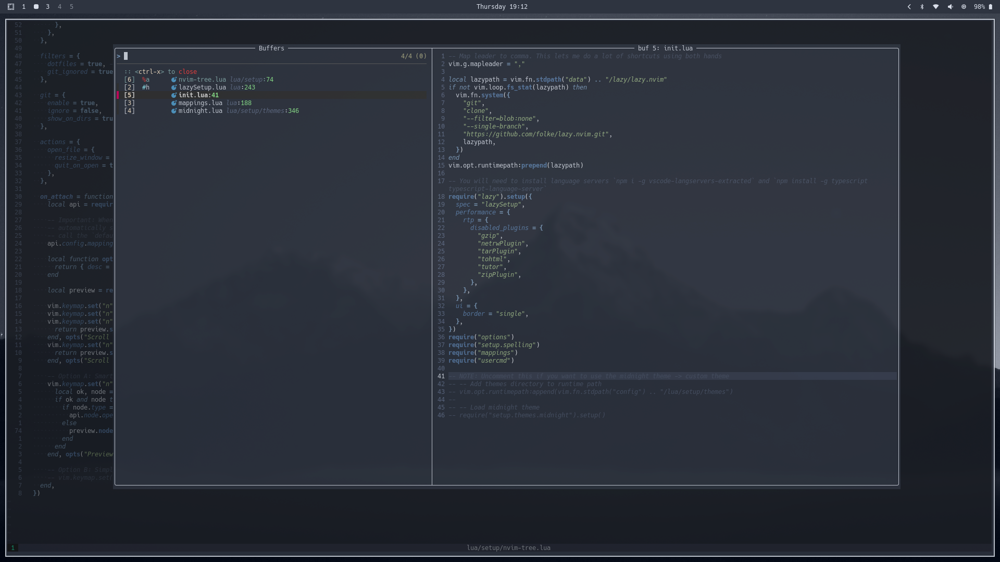
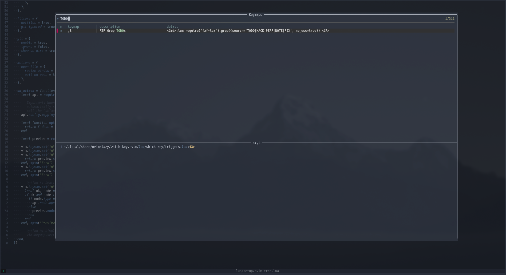
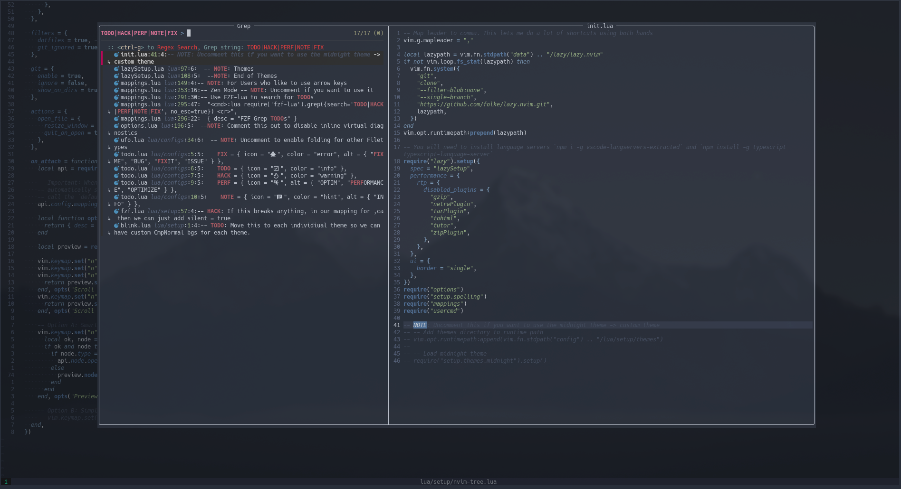

# 🚀 DevDad Dotfiles

> A comprehensive collection of configuration files for a productive development environment

## 📋 Overview

Welcome to my personal dotfiles repository! This collection includes configurations for Neovim, Tmux, Niri (Wayland compositor), Yazi file manager, and various shell tools. These configurations are designed to create a cohesive, efficient, and visually appealing development workflow.

## ✨ Features

### 🎯 Neovim Configurations
- **Multiple Configurations**: NvChad and custom Neovim variants
- 🔥 Full-fledged IDE experience with modern plugins
- 💤 Extensible with lazy.nvim plugin manager
- 🚀 Blazingly fast startup and performance
- 🧹 Sane defaults for options, autocmds, and keymaps
- 📦 Pre-configured plugins for productivity

### 🛠️ Development Tools
- **Tmux**: Productive terminal multiplexer with plugins
- **Yazi**: Modern file manager with custom plugins
- **FZF**: Enhanced fuzzy finding with custom functions
- **Shell**: Optimized Zsh configuration with useful plugins

### 🖥️ Desktop Environment
- **QuickShell**: Modern desktop shell with Noctalia theme
- **Waybar**: Custom status bar configuration

## ⚙️ System Requirements

### Core Dependencies
- **Neovim** >= 0.9.0 (built with LuaJIT)
- **Git** >= 2.19.0 (for partial clones support)
- **Nerd Font** v3.0+ (for icon display)
- **C Compiler** (for nvim-treesitter compilation)

### Recommended Tools
- **lazygit** (Git UI)
- **curl** (for blink.cmp completion)
- **fzf** v0.25.1+ (fuzzy finding)
- **ripgrep** (live grep)
- **fd** (file finding)

### Terminal Requirements
A terminal supporting true color and undercurl:
- **kitty** (Linux & macOS)
- **wezterm** (Linux, macOS & Windows)
- **alacritty** (Linux, macOS & Windows)
- **iterm2** (macOS)

### Package Installation (Arch Linux)
```bash
sudo pacman -S --needed git base-devel clang gcc go nodejs npm yarn python python-pip luarocks unzip wget ripgrep fd fzf
```

## 🖼️ Screenshots

### 📁 File Management & Navigation

#### Nvim Tree File Explorer
| File Browser | File Preview |
|--------------|--------------|
|  |  |

#### Mini Files Plugin


### 🔍 Fuzzy Finding & Search

#### Custom FZF Functions
| CD Function | File Picker |
|-------------|-------------|
|  |  |

#### FZF-Lua Integration
| Files | Buffers | Keymaps | Todos |
|-------|---------|---------|-------|
|  |  |  |  |

### Recommended Packages

> Required for some LazyVim plugins, Mason, LSPs.

```bash
sudo pacman -S --needed git base-devel clang gcc go nodejs npm yarn python python-pip luarocks unzip wget ripgrep fd
```

## 🛠️ Installation

### 1. Clone the Repository

```bash
git clone https://github.com/DevDad-Main/dotfiles.git ~/.config/
```

### 2. Shell Setup (Zsh + Oh My Zsh)

<details>
<summary>📚 Zsh Configuration</summary>

#### Install Zsh and Oh My Zsh
```bash
sudo pacman -Syu zsh
sh -c "$(curl -fsSL https://raw.githubusercontent.com/ohmyzsh/ohmyzsh/master/tools/install.sh)"
```

#### Install Essential Plugins
```bash
# Auto-suggestions
git clone https://github.com/zsh-users/zsh-autosuggestions.git $ZSH_CUSTOM/plugins/zsh-autosuggestions

# Syntax highlighting
git clone https://github.com/zsh-users/zsh-syntax-highlighting.git $ZSH_CUSTOM/plugins/zsh-syntax-highlighting

# Fast syntax highlighting
git clone https://github.com/zdharma-continuum/fast-syntax-highlighting.git ${ZSH_CUSTOM:-$HOME/.oh-my-zsh/custom}/plugins/fast-syntax-highlighting

# Auto-completion
git clone --depth 1 -- https://github.com/marlonrichert/zsh-autocomplete.git $ZSH_CUSTOM/plugins/zsh-autocomplete

# FZF tab completion
git clone https://github.com/Aloxaf/fzf-tab ${ZSH_CUSTOM:-~/.oh-my-zsh/custom}/plugins/fzf-tab
```

#### Link Custom Zsh Configuration
```bash
# Backup existing .zshrc if needed
mv ~/.zshrc ~/.zshrc.backup

# Link the custom configuration
ln -s ~/.config/dotfiles/.zshrc ~/
```

</details>

### 3. Desktop Environment (Niri + Wayland)

<details>
<summary>🖥️ Niri Wayland Compositor Setup</summary>

> **Note**: These instructions are for Arch Linux. Adjust package names for your distribution.

#### Install Niri and Essential Packages
```bash
yay -S niri fuzzel mako waybar xdg-desktop-portal-gtk alacritty swaybg swayidle swaylock xwayland-satellite udiskie
```

#### Install Noctalia-Shell Dependencies
```bash
# Core dependencies (required)
yay -S quickshell ttf-roboto inter-font gpu-screen-recorder brightnessctl

# Desktop monitor brightness (optional, may cause instability with some monitors)
yay -S ddcutil

# Optional dependencies for enhanced functionality
yay -S cliphist matugen-git cava wlsunset xdg-desktop-portal python3 evolution-data-server

# Polkit agent (can be any other agent)
yay -S polkit-kde-agent
```

#### Install Noctalia-Shell
```bash
mkdir -p ~/.config/quickshell/noctalia-shell && \
curl -sL https://github.com/noctalia-dev/noctalia-shell/releases/latest/download/noctalia-latest.tar.gz | \
tar -xz --strip-components=1 -C ~/.config/quickshell/noctalia-shell
```

</details>

### 4. Create Configuration Symlinks

<details>
<summary>🔗 Link All Configurations</summary>

```bash
# Neovim Configurations
ln -s ~/.config/dotfiles/NvChad_devdad ~/.config/NvChad
ln -s ~/.config/dotfiles/neovim ~/.config/neovim

# Development Tools
ln -s ~/.config/dotfiles/tmux ~/.config/tmux
ln -s ~/.config/dotfiles/yazi ~/.config/yazi

# Desktop Environment
ln -s ~/.config/dotfiles/niri/quickshell ~/.config/quickshell
ln -s ~/.config/dotfiles/omarchy/config/waybar ~/.config/waybar
```

</details>

## 📁 Project Structure

```
dotfiles/
├── 📁 NvChad_devdad/           # NvChad-based Neovim config
├── 📁 neovim/                  # Custom Neovim configuration
├── 📁 tmux/                    # Tmux configuration and plugins
├── 📁 yazi/                    # Yazi file manager config
├── 📁 niri/                    # QuickShell and desktop configs
│   └── 📁 quickshell/         # QuickShell with Noctalia theme
├── 📁 omarchy/                # Additional configs (Waybar, etc.)
├── 📄 .zshrc                   # Zsh shell configuration
├── 📄 toggle_record.sh         # Utility script
└── 📄 README.md               # This file
```

## 🎯 Key Features

### Neovim Configurations
- **NvChad_devdad**: Feature-rich configuration with custom themes and plugins
- **neovim**: Custom configuration with modern plugins and productivity tools

### Productivity Tools
- **Custom FZF Functions**: Enhanced directory navigation and file picking
- **Tmux Setup**: Productive terminal multiplexing with useful plugins
- **Yazi Configuration**: Modern file manager with custom plugins

### Desktop Environment
- **QuickShell**: Modern desktop shell with Noctalia theme integration
- **Waybar**: Custom status bar for desktop environment
- **Integrated Workflow**: Seamless integration between all components

## 🤝 Contributing

Feel free to fork this repository, customize it for your needs, or open issues for suggestions and improvements!

## 📄 License

This project is open source and available under the [MIT License](LICENSE).

---

**Made with ❤️ by [DevDad](https://github.com/DevDad-Main)**

> ⭐ If you find this useful, consider giving it a star!
