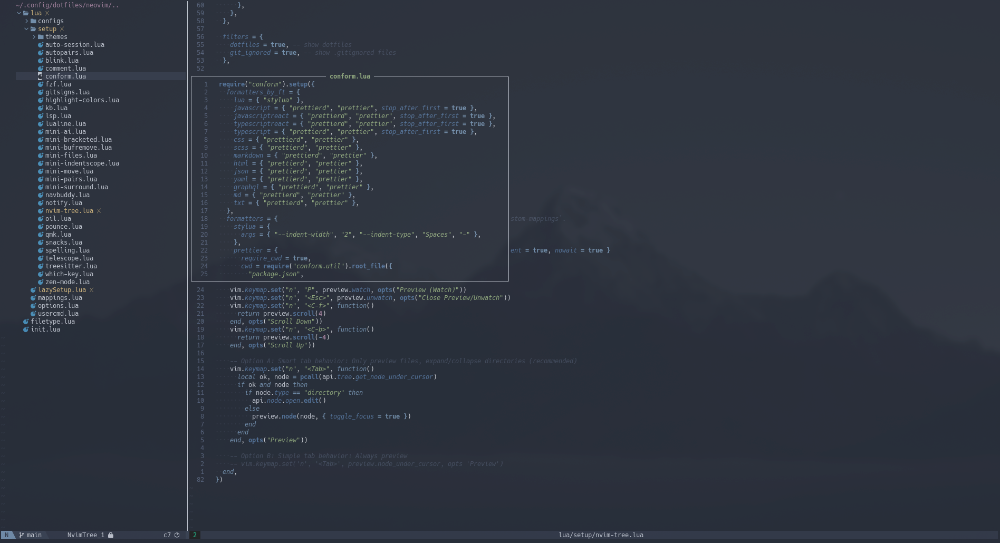
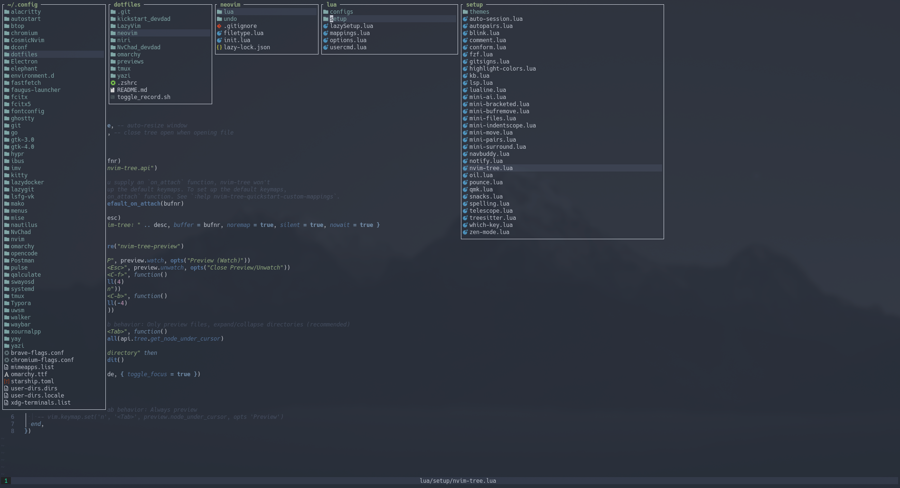
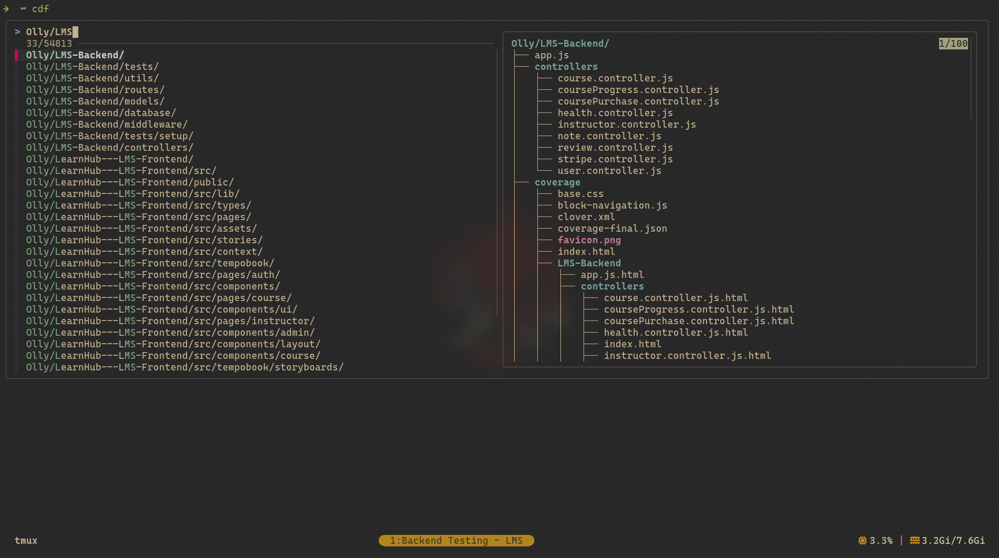
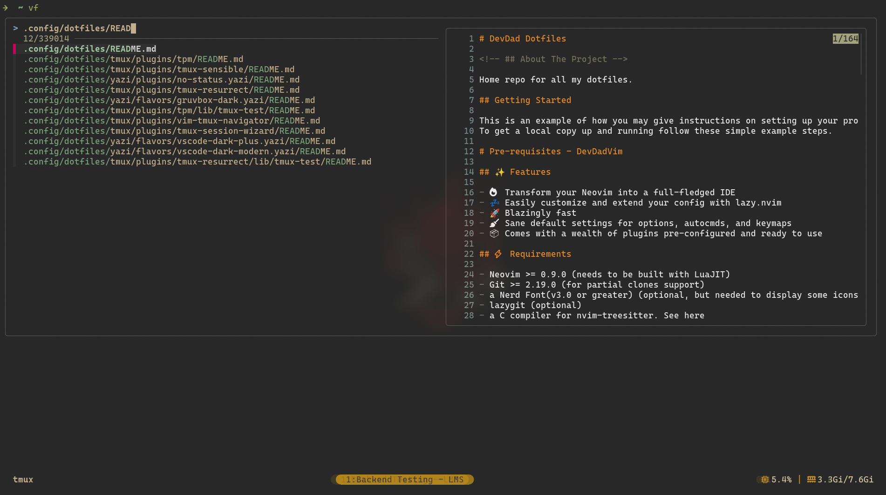
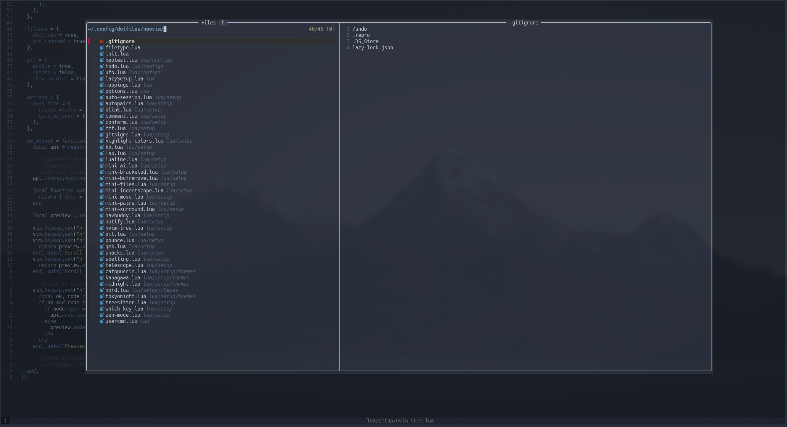
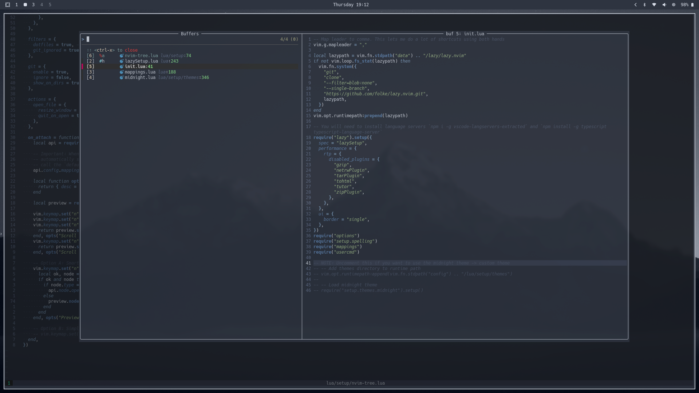
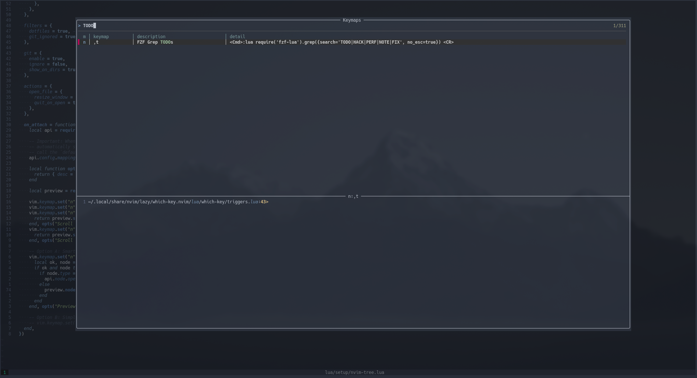
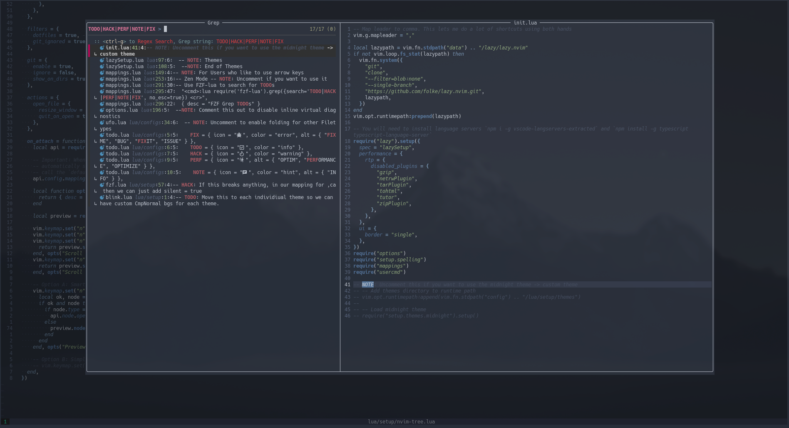

# Dotfiles

> Personal configuration files for a productive development environment on Arch Linux with Hyprland.

## Overview

Configurations for Neovim (multiple variants), Tmux, Hyprland (Wayland compositor), Yazi file manager, Zsh, Starship, Fastfetch, Zed editor, and more.

## Features

### Neovim Configurations
- **nvim** — Main configuration with lazy.nvim, treesitter, telescope, nvim-tree
- **neovim** — Alternative config with lazy.nvim, fzf-lua, mini.files, nvim-tree
- **neovim-nvchad** — NvChad-based configuration

### Desktop Environment
- **Hyprland** — Modern dynamic tiling Wayland compositor (with Quickshell integration)
- **Wallpapers** — Collection of desktop wallpapers

### Shell & Tools
- **Zsh** — Oh My Zsh with plugins (autosuggestions, syntax highlighting, fzf-tab)
- **Starship** — Cross-shell prompt
- **Fastfetch** — System information tool
- **Tmux** — Terminal multiplexer with plugins
- **Yazi** — Modern file manager with custom plugins
- **Zed** — Editor configuration
- **Toggle Record** — Screen recording toggle script

## Requirements

- Arch Linux (recommended) or other Linux distribution
- Terminal with true color and undercurl support (kitty, wezterm, alacritty)
- Nerd Font v3.0+
- Neovim >= 0.9.0 (for Neovim configs)

### Installation

```bash
# Clone the repository
git clone https://github.com/oliverm/dotfiles.git ~/.config/dotfiles
```

### Shell Setup

<details>
<summary>Zsh Configuration</summary>

```bash
# Install Zsh and Oh My Zsh
sudo pacman -S zsh
sh -c "$(curl -fsSL https://raw.githubusercontent.com/ohmyzsh/ohmyzsh/master/tools/install.sh)"

# Install plugins
git clone https://github.com/zsh-users/zsh-autosuggestions.git $ZSH_CUSTOM/plugins/zsh-autosuggestions
git clone https://github.com/zsh-users/zsh-syntax-highlighting.git $ZSH_CUSTOM/plugins/zsh-syntax-highlighting
git clone https://github.com/zdharma-continuum/fast-syntax-highlighting.git ${ZSH_CUSTOM:-$HOME/.oh-my-zsh/custom}/plugins/fast-syntax-highlighting
git clone https://github.com/Aloxaf/fzf-tab ${ZSH_CUSTOM:-~/.oh-my-zsh/custom}/plugins/fzf-tab

# Source dotfiles config from ~/.zshrc
echo "source ~/.config/dotfiles/.zshrc" >> ~/.zshrc
```

</details>

### Hyprland Setup

<details>
<summary>Hyprland Wayland Compositor</summary>

```bash
# Install Hyprland and essential packages
sudo pacman -S hyprland hyprlock hypridle waybar wofi mako xdg-desktop-portal-hyprland alacritty swaybg brightnessctl

# Install Quickshell (if using Quickshell features)
yay -S quickshell
```

</details>

### Symlinks

<details>
<summary>Create Configuration Symlinks</summary>

```bash
# Create symlinks for each configuration
ln -sf ~/.config/dotfiles/nvim ~/.config/nvim
ln -sf ~/.config/dotfiles/tmux ~/.config/tmux
ln -sf ~/.config/dotfiles/yazi ~/.config/yazi
ln -sf ~/.config/dotfiles/hypr ~/.config/hypr
ln -sf ~/.config/dotfiles/starship ~/.config/starship
ln -sf ~/.config/dotfiles/fastfetch ~/.config/fastfetch
ln -sf ~/.config/dotfiles/zed ~/.config/zed
```

</details>

## Project Structure

```
dotfiles/
├── nvim/                 # Main Neovim configuration
├── neovim/               # Alternative Neovim configuration
├── neovim-nvchad/        # NvChad-based Neovim config
├── hypr/                 # Hyprland compositor config
│   ├── hyprland/         #   Window manager settings
│   ├── hyprlock.conf     #   Lock screen config
│   ├── hypridle.conf     #   Idle management config
│   └── custom/           #   Custom scripts
├── tmux/                 # Tmux configuration
├── yazi/                 # Yazi file manager config
├── starship/             # Starship prompt config
├── fastfetch/            # Fastfetch system info config
├── zed/                  # Zed editor config
├── wallpapers/           # Desktop wallpapers
├── .vim/                 # Legacy Vim configuration
├── .zshrc                # Zsh shell configuration
├── toggle_record.sh      # Screen recording toggle script
└── README.md             # This file
```

## Screenshots

### File Management

| File Browser | File Preview |
|---|---|
|  |  |



### Fuzzy Finding

| CD Function | File Picker |
|---|---|
|  |  |

| Files | Buffers | Keymaps | Todos |
|---|---|---|---|
|  |  |  |  |

## License

MIT
