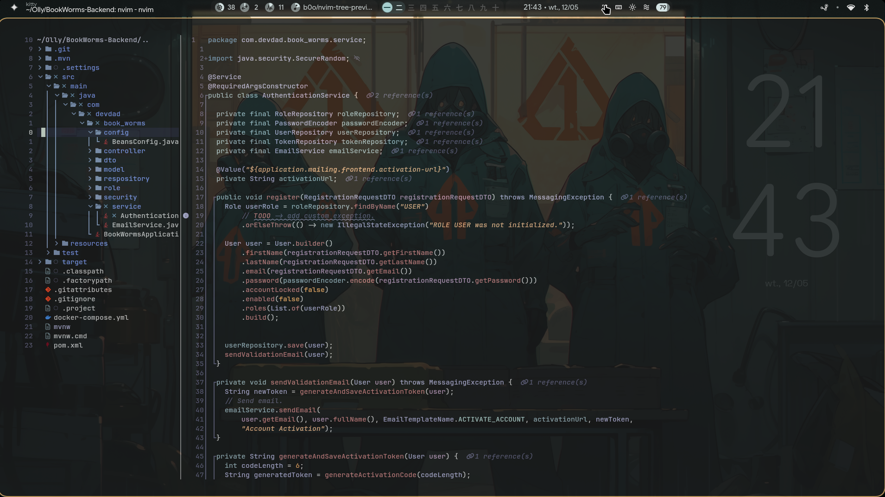
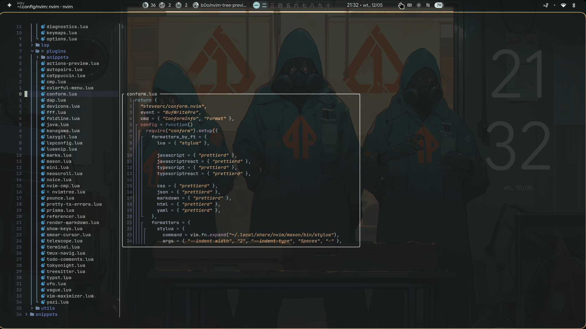
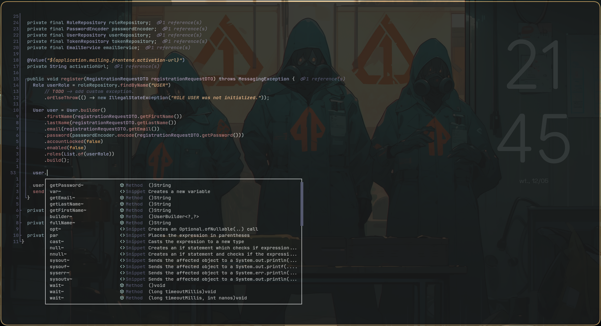
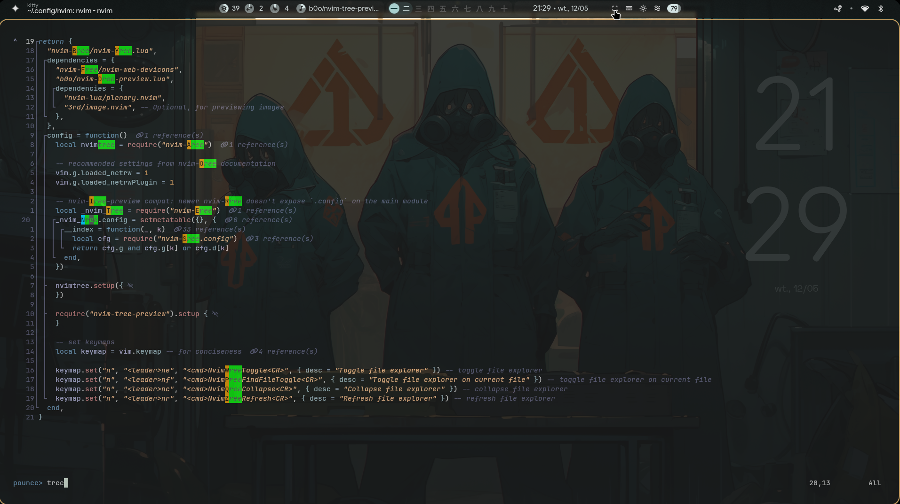
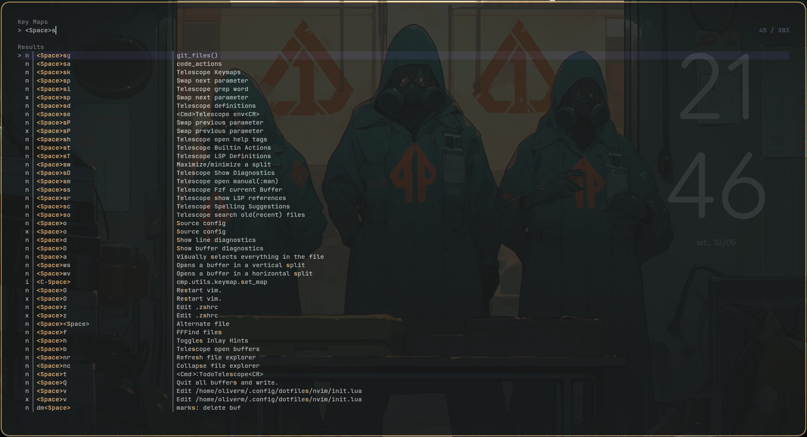
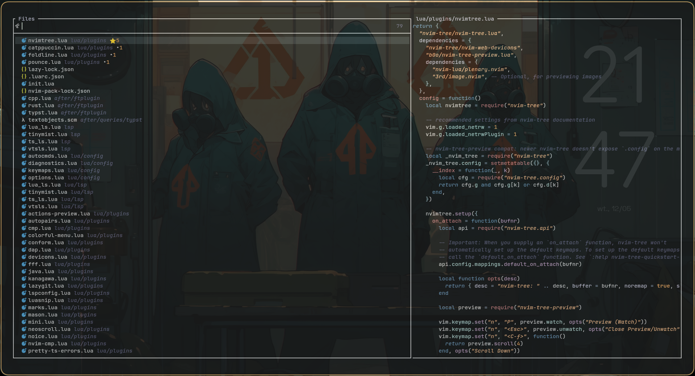

# Dotfiles

> Personal configuration files for a productive development environment on Arch Linux with Hyprland.
>
> **Hyprland config**: Built on top of [end-4/dots-hyprland](https://github.com/end-4/dots-hyprland) — the `hypr/` directory in this repo contains my custom overrides that layer on top of end4's setup.

<details>
<summary>🖼️ Previews</summary>

### Neovim



**Nvim Tree** — File explorer with modern icons, git integration, and project browsing.



**File Preview** — Integrated file preview powered by Telescope for quick content inspection.



**LSP Support** — Full language server protocol integration across all languages with diagnostics, completion, and code actions.



**Pounce** — Lightning-fast buffer navigation with semantic matching for precise cursor movement.



**Telescope** — Fuzzy-find everything: keymaps, buffers, files, and more with extensible pickers.



**Frecency-based Fuzzy Finder** — Smart file search that learns your frequent and recent files.

</details>

## Overview

Configurations for Neovim (multiple variants), Tmux, Hyprland (Wayland compositor), Yazi file manager, Zsh, Starship, Fastfetch, Zed editor, and more.

## Features

### Neovim Configurations

- **nvim** — Main configuration with lazy.nvim, treesitter, telescope, nvim-tree
- **neovim** — Alternative config with lazy.nvim, fzf-lua, mini.files, nvim-tree
- **neovim-nvchad** — NvChad-based configuration

### Desktop Environment

- **Hyprland** — Modern dynamic tiling Wayland compositor (with Quickshell integration)
- **i3** — Minimal X11 tiling window manager with Gruvbox theme
- **Wallpapers** — Collection of desktop wallpapers

### Shell & Tools

- **Zsh** — Oh My Zsh with plugins (autosuggestions, syntax highlighting, fzf-tab)
- **Starship** — Cross-shell prompt
- **Fastfetch** — System information tool
- **Tmux** — Terminal multiplexer with plugins
- **Yazi** — Modern file manager with custom plugins
- **Zed** — Editor configuration
- **Toggle Record** — Screen recording toggle script

## Requirements

- Arch Linux (recommended) or other Linux distribution
- Terminal with true color and undercurl support (kitty, wezterm, alacritty)
- Nerd Font v3.0+
- Neovim >= 0.9.0 (for Neovim configs)

### Installation

```bash
# Clone the repository
git clone https://github.com/DevDad-Main/dotfiles.git ~/.config/dotfiles
```

### Shell Setup

<details>
<summary>Zsh Configuration</summary>

```bash
# Install Zsh and Oh My Zsh
sudo pacman -S zsh
sh -c "$(curl -fsSL https://raw.githubusercontent.com/ohmyzsh/ohmyzsh/master/tools/install.sh)"

# Install plugins
git clone https://github.com/zsh-users/zsh-autosuggestions.git $ZSH_CUSTOM/plugins/zsh-autosuggestions
git clone https://github.com/zsh-users/zsh-syntax-highlighting.git $ZSH_CUSTOM/plugins/zsh-syntax-highlighting
git clone https://github.com/zdharma-continuum/fast-syntax-highlighting.git ${ZSH_CUSTOM:-$HOME/.oh-my-zsh/custom}/plugins/fast-syntax-highlighting
git clone https://github.com/Aloxaf/fzf-tab ${ZSH_CUSTOM:-~/.oh-my-zsh/custom}/plugins/fzf-tab

# Symlink dotfiles config and set as default shell
ln -sf ~/.config/dotfiles/.zshrc ~/.zshrc
chsh -s /usr/bin/zsh
```

</details>

<details>
<summary>i3 Window Manager</summary>

A minimal keyboard-driven i3 config with Gruvbox dark theme, vim-style navigation, and rofi spotlight launcher.

### Installation

```bash
sudo pacman -S xorg-server xorg-xinit xorg-xrandr i3-wm i3status-rust rofi kitty picom dunst feh brightnessctl playerctl bluetui haruna gwenview maim slop xclip i3lock power-profiles-daemon
```

### Backup

``` bash
mkdir -p ~/config-backup
cp -r ~/.config ~/config-backup/
cp -r ~/.local ~/config-backup/
```

### Symlink

```bash
ln -sf ~/.config/dotfiles/i3 ~/.config/i3
ln -sf ~/.config/dotfiles/rofi ~/.config/rofi
ln -sf ~/.config/dotfiles/i3status-rust ~/.config/i3status-rust
```

### Keybindings

| Key | Action |
|---|---|
| `Super+Enter` | Terminal |
| `Super+Space` | Rofi app launcher (spotlight-style) |
| `Super+d` | Rofi app launcher |
| `Super+q` | Kill window |
| `Super+h/j/k/l` | Focus left/down/up/right |
| `Super+Shift+h/j/k/l` | Move window |
| `Super+y` | Toggle split direction |
| `Super+Shift+y` | Reset all to horizontal split |
| `Super+s` | Stacking layout |
| `Super+w` | Tabbed layout |
| `Super+1-0` | Switch workspace |
| `Super+Shift+1-0` | Move window to workspace |
| `Super+r` | Resize mode (h/j/k/l) |
| `Super+Shift+r` | Restart i3 |
| `Super+Shift+e` | Exit i3 |
| `Super+Ctrl+q` | Power menu (shutdown/reboot/lock/etc) |
| `Super+Shift+s` | Region screenshot (clipboard) |
| `Super+Print` | Fullscreen screenshot (clipboard) |
| `Print` | Fullscreen screenshot (file) |

Wallpaper: set path in `~/.config/i3/config` under the `feh --bg-fill` line.

### Reverting back to previous DE/WM config.

``` bash
cp -r ~/config-backup/.config/* ~/.config/
cp -r ~/config-backup/.local/* ~/.local/
```

</details>

### Using this config with end4's Hyprdots

```bash
# Replace end4's hypr config with my custom overrides
mv ~/.config/hypr ~/.config/hypr.bak && ln -s ~/.config/dotfiles/hypr ~/.config/hypr
```

### Symlinks

<details>
<summary>Create Configuration Symlinks</summary>

```bash
# Create symlinks for each configuration
ln -sf ~/.config/dotfiles/nvim ~/.config/nvim
ln -sf ~/.config/dotfiles/tmux ~/.config/tmux
ln -sf ~/.config/dotfiles/yazi ~/.config/yazi
ln -sf ~/.config/dotfiles/hypr ~/.config/hypr
ln -sf ~/.config/dotfiles/starship ~/.config/starship
ln -sf ~/.config/dotfiles/fastfetch ~/.config/fastfetch
ln -sf ~/.config/dotfiles/zed ~/.config/zed
ln -sf ~/.config/dotfiles/i3 ~/.config/i3
ln -sf ~/.config/dotfiles/rofi ~/.config/rofi
ln -sf ~/.config/dotfiles/i3status-rust ~/.config/i3status-rust
```

</details>

## Project Structure

```
dotfiles/
├── nvim/                 # Main Neovim configuration
├── neovim/               # Alternative Neovim configuration
├── neovim-nvchad/        # NvChad-based Neovim config
├── i3/                   # i3 window manager config
├── i3status-rust/        # i3status-rust bar config
├── rofi/                 # Rofi launcher config
├── hypr/                 # Hyprland compositor config
│   ├── hyprland/         #   Window manager settings
│   ├── hyprlock.conf     #   Lock screen config
│   ├── hypridle.conf     #   Idle management config
│   └── custom/           #   Custom scripts
├── tmux/                 # Tmux configuration
├── yazi/                 # Yazi file manager config
├── starship/             # Starship prompt config
├── fastfetch/            # Fastfetch system info config
├── zed/                  # Zed editor config
├── wallpapers/           # Desktop wallpapers
├── .vim/                 # Legacy Vim configuration
├── .zshrc                # Zsh shell configuration
├── toggle_record.sh      # Screen recording toggle script
└── README.md             # This file
```

## License

MIT
