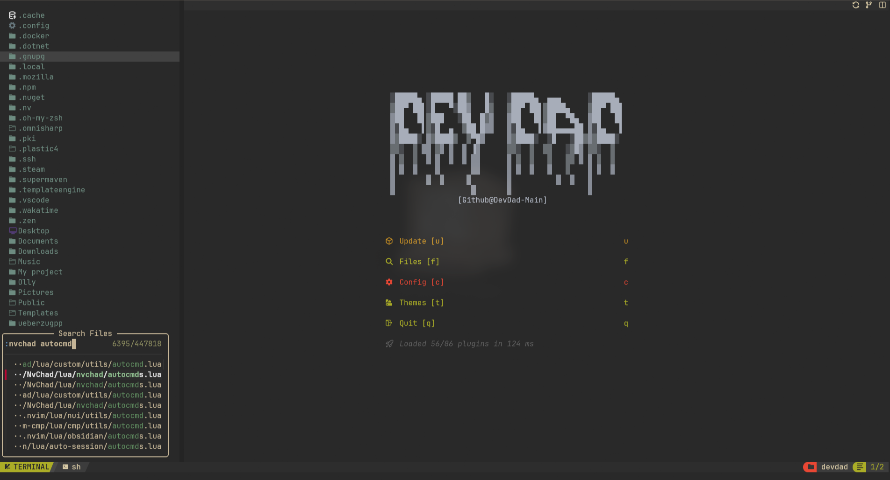

# DevDad Dotfiles

<!-- ## About The Project -->

Home repo for all my dotfiles.

## Getting Started

This is an example of how you may give instructions on setting up your project locally.
To get a local copy up and running follow these simple example steps.

# Pre-requisites - DevDadVim

## ✨ Features

- 🔥 Transform your Neovim into a full-fledged IDE
- 💤 Easily customize and extend your config with lazy.nvim
- 🚀 Blazingly fast
- 🧹 Sane default settings for options, autocmds, and keymaps
- 📦 Comes with a wealth of plugins pre-configured and ready to use

## ⚡️ Requirements

- Neovim >= 0.9.0 (needs to be built with LuaJIT)
- Git >= 2.19.0 (for partial clones support)
- a Nerd Font(v3.0 or greater) (optional, but needed to display some icons)
- lazygit (optional)
- a C compiler for nvim-treesitter. See here
- curl for blink.cmp (completion engine)
- for fzf-lua (optional)
- fzf: fzf (v0.25.1 or greater)
- live grep: ripgrep
- find files: fd
- a terminal that supports true color and undercurl:
  - kitty (Linux & Macos)
  - wezterm (Linux, Macos & Windows)
  - alacritty (Linux, Macos & Windows)
  - iterm2 (Macos)

### 🖼️ Preview

## NvDash - DevDad


## Nvim-Tree


## Telescope & Telescope-Frecency


## Grug Far


## Telescope Buffers With Terminals via builtin :term


## Telescope Fzf Todos


## ToggleTerm Vscode Style Terminals


## Telescope Keymaps


## NvimTree - Custom Fzf File Picker



## NvimTree - Custom Fzf Directory Picker (Majorly needed for NvimTree/Neovide)


## Tmux


## Custom Fzf Functions

> cd quicker than cd with fzf
> 
> find files quicker than find with fzf and open them with your favourite editor
> 

### Recommended Packages

> Required for some LazyVim plugins, Mason, LSPs.

```bash
sudo pacman -S --needed git base-devel clang gcc go nodejs npm yarn python python-pip luarocks unzip wget ripgrep fd
```

## Installation for .zshrc and custom fzf functions

<details>

<summary>Zsh - OhMyZsh </summary>

```bash
sudo pacman -Syu zsh
sh -c "$(curl -fsSL https://raw.githubusercontent.com/ohmyzsh/ohmyzsh/master/tools/install.sh)"
```

- autosuggesions plugin

  ```bash
  git clone https://github.com/zsh-users/zsh-autosuggestions.git $ZSH_CUSTOM/plugins/zsh-autosuggestions
  ```

- zsh-syntax-highlighting plugin

  ```bash
  git clone https://github.com/zsh-users/zsh-syntax-highlighting.git $ZSH_CUSTOM/plugins/zsh-syntax-highlighting
  ```

- zsh-fast-syntax-highlighting plugin

  ```bash
  git clone https://github.com/zdharma-continuum/fast-syntax-highlighting.git ${ZSH_CUSTOM:-$HOME/.oh-my-zsh/custom}/plugins/fast-syntax-highlighting
  ```

- zsh-autocomplete plugin

  ```bash
  git clone --depth 1 -- https://github.com/marlonrichert/zsh-autocomplete.git $ZSH_CUSTOM/plugins/zsh-autocomplete
  ```

- zsh-fsf plugin
  ```bash
  git clone https://github.com/Aloxaf/fzf-tab ${ZSH_CUSTOM:-~/.oh-my-zsh/custom}/plugins/fzf-tab
  ```

> Remove the ~/zshrc file and replace it with the one in this repo

```bash

ln -s ~/.config/dotfiles/.zshrc ~/
```

</details>

# Installation

#### 1. Clone the repo:

- Optionally if you are downloading the repo manually just place everything that is inside of the dotfiles directory into the ~./config directory and you can skip the next steps.

  ```bash
  git clone https://github.com/DevDad-Main/dotfiles.git ~/.config/
  ```

#### 2. Create symlinks to the repo:

- Due to how the $XDG_CONFIG_HOME is set, we need to create symlinks

  ```bash
  ln -s ~/.config/dotfiles/NvChad_devdad ~/.config/NvChad
  ln -s ~/.config/dotfiles/LazyVim ~/.config/LazyVim
  ln -s ~/.config/dotfiles/kickstart_devdad/ ~/.config/kickstart
  ln -s ~/.config/dotfiles/tmux ~/.config/tmux
  ln -s ~/.config/dotfiles/yazi ~/.config/yazi
  ln -s ~/.config/dotfiles/vscode/.config/Code/User/ ~/.config/Code/
  ```

#### 3. For Vscode config:

- We need to now install the extensions from the extenstions.txt file

```bash
cat ~/.config/dotfiles/vscode/.config/Code/User/extensions.txt | xargs -L 1 code --install-extension
```
